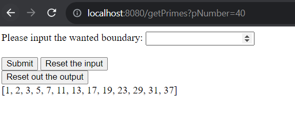

# **Prime Numbers Generator**
My full-stack app to generate a set of prime numbers within a given boundary.

## About:

A visual representation can be seen below:

## Technologies Used

- Java 11
- HTML
- Thymeleaf

## The Process:
### 
The basis is the PrimeGenerator class placed in the utils folder, 
it determines if a number is prime if a number is not divisible by
2,3,5, and any other prime number. 

### Java Maven Project:

The PrimeGenerator is later used in the service class. 
The interaction with the user happens in the controller class. 

The controller class switches between different views depending 
on the actions.

### Front End Development:

The application uses Thymeleaf views as base for frontend.
The main interaction is the primesForm.html